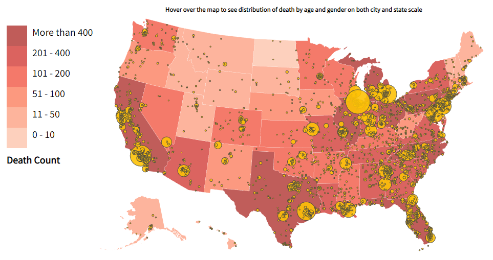

# US Gun Death Visualization
This project aims to visualize and analyze gun-related deaths across the United States, providing insights into the distribution and patterns of these incidents. By presenting data through various interactive and informative visualizations, we seek to offer a comprehensive understanding of gun deaths at both state and city levels. The project incorporates multiple visualization techniques to showcase different aspects of the data, including geographic distribution, gender ratios, and age group breakdowns. Our goal is to create an accessible and informative tool for researchers, policymakers, and the general public to explore this critical issue.

- __Access this project:__ https://komar41.github.io/US-Gun-Deaths
- __GitHub repo:__ https://github.com/komar41/US-Gun-Deaths
- __Tools used:__ - Python, NumPy, Pandas, JavaScript, HTML, CSS, SVG, D3.js

## Components

### 1. Choropleth Map & Bubble Chart Overlay

- The choropleth map visualizes the distribution of US gun deaths across all states
- Legend showing colors for each classes of the distribution: 0-10, 11-50, etc
- A title with instructions on how to interact with the map
- The overlaid bubbles on the map to show city-scale distribution. Circle sizes represent death counts. 
- Proper normalization used for circle sizes for accurate representation

### 3. Pie Chart & Horizontal Bar Chart (on hover)

- Pie chart shows gender distribution for a selected state/city. Includes exact numbers for each gender
- Horizontal bar chart displays age distribution for the same selected state/city. Includes exact numbers for each age group

### 5. State-wide Bar Chart

- Located at the bottom of the visualization
- Shows death counts across all states in one view

## Interaction Features

- Hover over states/cities to display detailed pie and bar charts
- Title above the hover charts displays the selected state/city and total death count

## Visualization Inspirations
- [Bill Morris (Choropleth Map)](https://bl.ocks.org/wboykinm/dbbe50d1023f90d4e241712395c27fb3)
- [D3 Graph Gallery](https://d3-graph-gallery.com/)
- [Michelle Chandra (Basic US State Map)](https://github.com/academind/d3js-basics/tree/d3-demo-finished)
- [Academind](http://bl.ocks.org/michellechandra/0b2ce4923dc9b5809922)

### Additional Resources
- [Stack Overflow](https://stackoverflow.com/)
